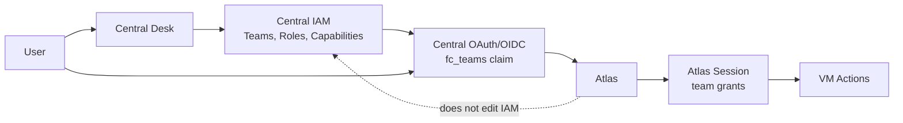
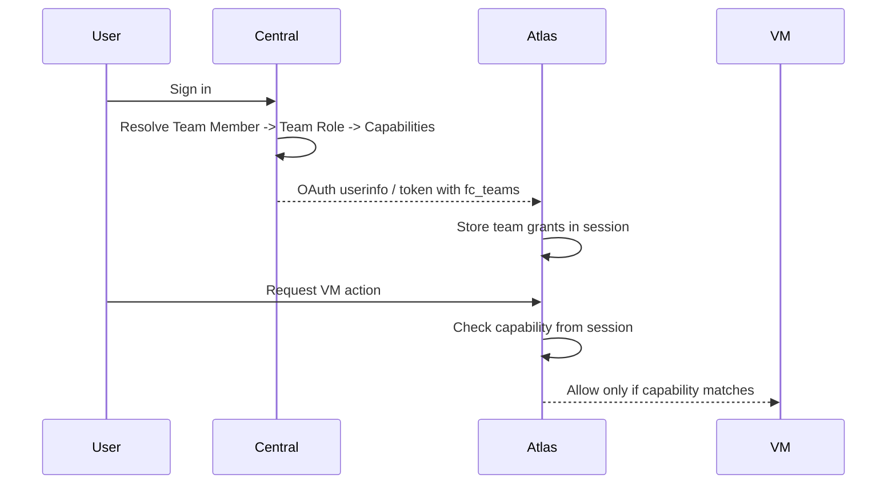

## Central

> [!WARNING]
> This project is currently **experimental** with the intention of making it usable in production.

Central is the global control plane and front door(console) of Frappe Cloud. It holds the mission control: it decides who you are, which team you act for, and what you are allowed to do before Atlas touches a VM. 

Central's duty is to be the IAM authority and Asset Registry for Frappe Cloud. It owns identity, teams, roles, capabilities, OAuth claims etc. Atlas consumes those claims and enforces them locally to apply changes.


Atlas repo - [https://github.com/adityahase/atlas](https://github.com/adityahase/atlas)

## Architecture




Central writes authority. Atlas reads authority.




## What Works

- Desk workspace for `Team`, `Team Role`, `Capability`, and `IAM Permission Probe`.
- Fixture-backed capability catalog.
- System team roles: `Owner`, `Admin`, `Developer`, `Viewer`, `Billing`.
- New enabled `User` records get `Central User`, one default team, and active
`Owner` membership.
- Team-scoped permission resolution through `Team Member -> Team Role -> Capability`.
- OAuth/OpenID userinfo includes the `fc_teams` claim for Atlas.
- Probe DocType can test `(user, team, capability)` from Desk.

## Not Yet

- Central frontend/team switcher.
- Atlas VM enforcement using `fc_teams`. Scoped VM (granular) permissions.
- Invite workflow UI and email flow.
- Partner/support access flows.

## Installation

From a bench:

```bash
bench get-app central <repo-url>
bench --site <site-name> install-app central
bench --site <site-name> migrate
```

For local development:

```bash
bench set-config -g developer_mode 1
bench --site central.site migrate
bench start
```

Open Desk at:

```text
http://central.site:8000/app
```

## Test Teams

1. Log in as `Administrator`.
2. Create or open a `User`.
3. Save the user. Central creates that user's default `Team` automatically.
4. Open `Team` and confirm:
  - `owner_user` is the new user.
  - Members has the same user as `Owner` and `Active`.
5. Add another user as `Viewer`, `Developer`, or `Admin`.

The user's effective permissions are always resolved from team membership. The
`owner_user` field is ownership metadata, not a permission bypass.

## Test Probe

Open:

```text
/app/iam-permission-probe/new
```

Set:

- `User`: the user to test.
- `Team`: the team they belong to.
- `Capability`: for example `vm:view` or `vm:terminate`.

Save the document. `Allowed` and `Resolved Grants` are filled automatically.

Good checks:

- `Viewer` + `vm:view` -> allowed.
- `Viewer` + `vm:terminate` -> denied.
- `Developer` + `vm:terminate` -> allowed.

## Atlas

Central already emits Atlas-ready IAM data through OAuth/OpenID:

```json
{
  "fc_teams": {
    "TEAM-00001": [
      {
        "role": "Viewer",
        "source": "member",
        "scope": "*",
        "caps": ["asset:view", "vm:view"]
      }
    ]
  }
}
```

Atlas should read `fc_teams` during SSO, store it in the session, and enforce VM
actions from that session. Atlas must not edit teams, roles, or capabilities.

## Tests

```bash
bench --site central.site run-tests --app central
```

## License

agpl-3.0
