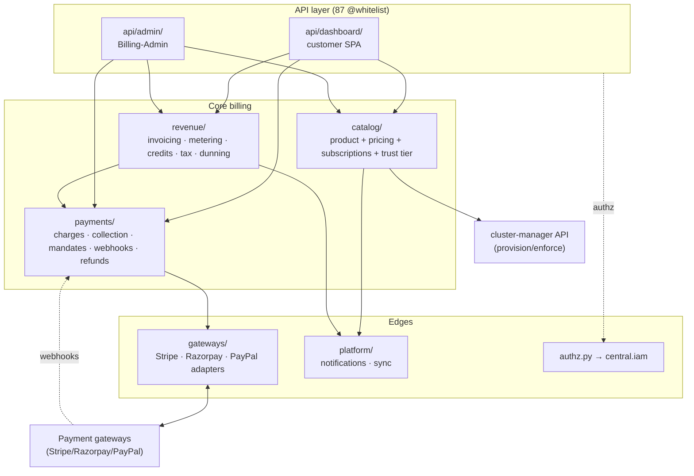
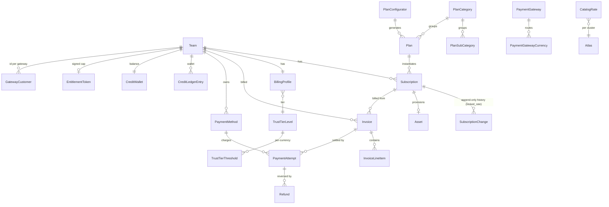
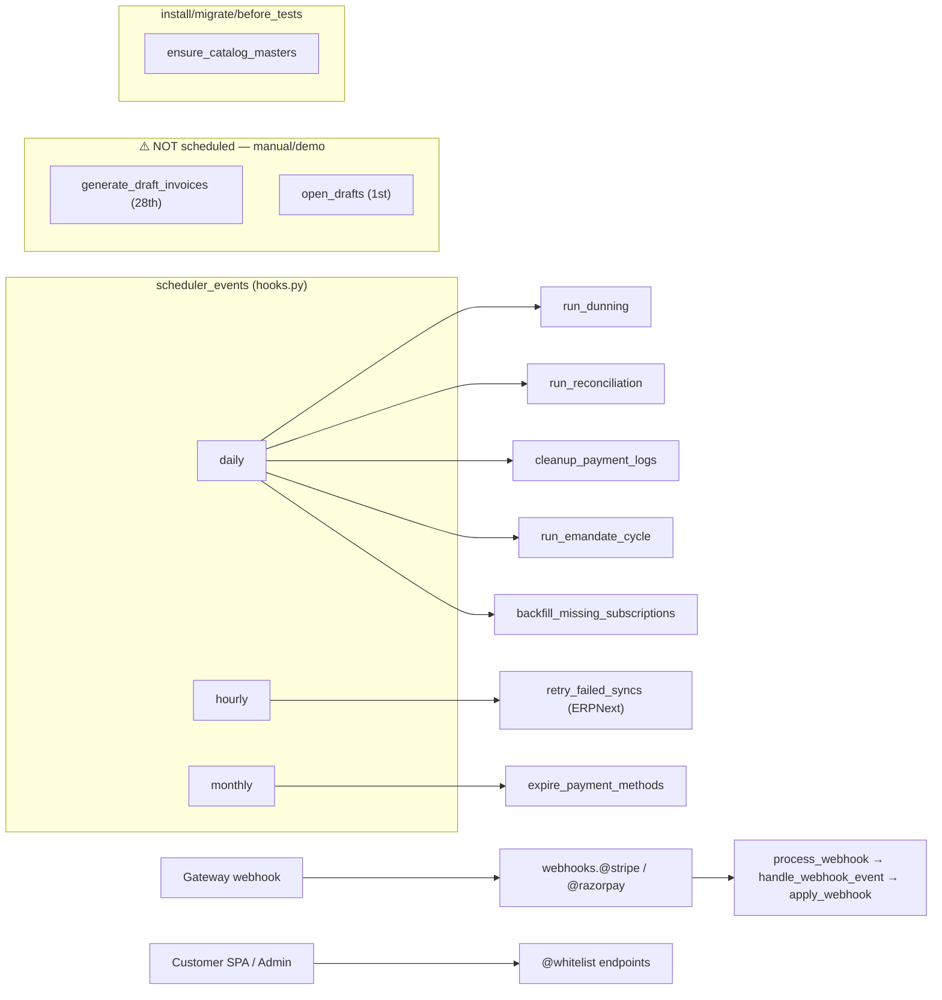
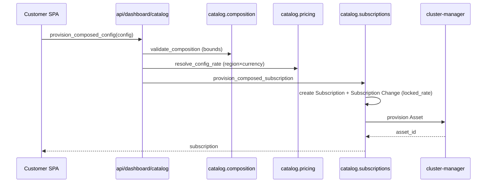
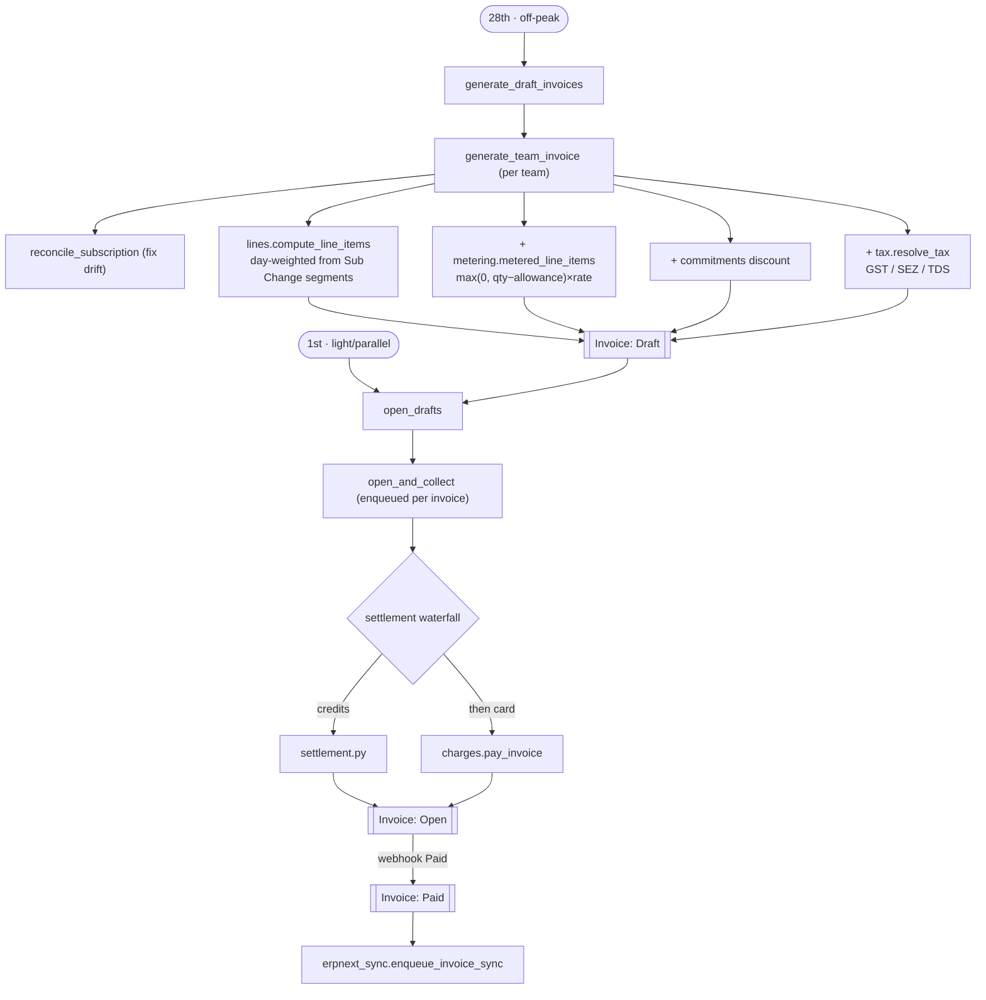
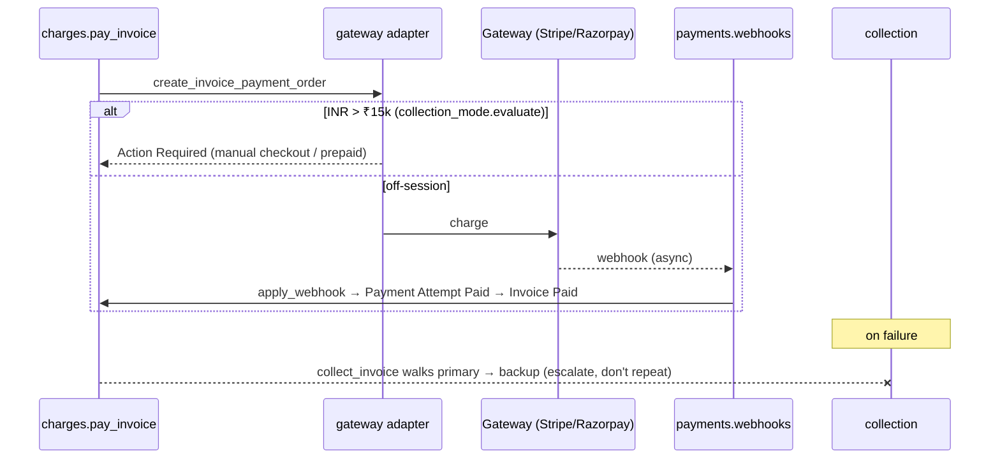
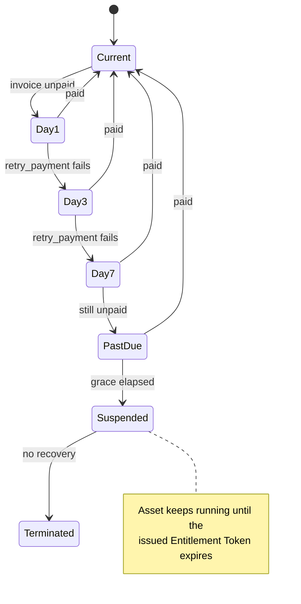
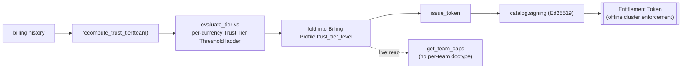

# Billing — Architecture & Debugging Map

> A glance-view of the `central.billing` module: what the sub-modules are, how they
> link, what triggers them, and where to look when something breaks. Start here, then
> jump to the named file. Paths are relative to `central/billing/`.
>
> 👉 To **stand up & demonstrate** billing from an empty site, see
> [`SETUP-AND-DEMO.md`](./SETUP-AND-DEMO.md).

Billing is a **postpaid, in-arrears** money system: Central provisions resources, records
the runtime it bills from, draws up an invoice in arrears, settles it (credits → card),
and chases the unpaid ones. There is **no Subscription Agent** (ADR 0006) — Central
provisions/records/enforces directly. Authorisation is Central's capability IAM
(ADR 0004), not billing-owned roles.

- **36 DocTypes**, **~10 sub-packages**, **87 whitelisted endpoints**.
- Money is **integer minor units** (paisa/cent) everywhere; rates are minor×10⁶ (ADR 0003).

---

## 1. Layered sub-module map



Read top-to-bottom — each layer calls the one below it.

| Layer | Package | What it owns |
|---|---|---|
| **API — customer** | `api/dashboard/` | Team-scoped reads/actions for the customer SPA (`account`, `catalog`, `invoices`, `methods`). |
| **API — admin** | `api/admin/` | Billing-Admin views: `catalog`, `revenue` (cost-explorer), `teams`, `gateways`. |
| **Catalog** | `catalog/` | The product & pricing authority: taxonomy masters, Plan Configurator, composed-config pricing, rate resolution, subscriptions (intent + state), trust tiers, entitlement signing. |
| **Revenue** | `revenue/` | Turning usage into money: `invoicing/` (draft→open→collect), `metering`, `credits`, `tax`, `commitments` discount, `dunning`, `pricelock`, `erpnext_sync`. |
| **Payments** | `payments/` | Moving the money: `charges`, `collection` (fallback), `collection_mode` (INR ₹15k gate), `mandates` (UPI), `emandate` (RBI), `payments` (cards), `webhooks`, `reconciliation`, `refunds`, `settlement`, `profile`. |
| **Gateways** | `gateways/` | The adapter seam: `base.GatewayAdapter` + `stripe`/`razorpay`/`paypal` + `registry`. |
| **Platform** | `platform/` | `notifications` (sole sender), `sync` (record the runtime billed from). |
| **Authz** | `authz.py` | Capability checks (delegates to `central.iam`). |

Cross-cutting reference data: `india_gst.py`, `regions.py`, `catalog/taxonomy_setup.py`.

---

## 2. Data model — the DocType graph



Grouped by concern. `→` = Link field; **[C]** = child table; **[S]** = submittable; **[1]** = single.

**Catalog / product**
```
Resource Type
Plan Category ──allowed_resource_types─→ [C]Plan Category Resource Type ─→ Resource Type
Plan Sub-Category ──category─→ Plan Category
Plan ──category─→ Plan Category, ──sub_category─→ Plan Sub-Category, ──includes─→ [C]Plan Includes ─→ Resource Type
Catalog Rate ──priced_doctype─→ DocType, ──priced_for─(dynamic)→, ──cluster─→ Atlas Instance, ──currency
Plan Configurator ─→ Category, Sub-Category, [C]base_rates, [C]rungs(─→Plan), [C]simple_plans(─→Plan)
```

**Subscription / state**
```
Subscription ──team, ──plan, ──sub_category, ──includes, ──default_payment_method,
             ──gateway, ──asset_id─→ Asset
Subscription Change ──subscription, ──team, ──currency      (append-only history + locked_rate)
Price Lock ──team, ──plan                                    (RETIRED — see §6; rate now lives on Subscription Change)
```

**Invoice / money**
```
Invoice [S] ──team, ──subscription, ──items─→ [C]Invoice Line Item
Payment Attempt ──invoice, ──team, ──gateway, ──payment_method
Refund ──payment_attempt, ──invoice, ──team
Credit Ledger Entry ──team, ──currency        (append-only)
Credit Wallet ──team                           (lock anchor / cached balance)
Commitment [S] ──team, ──currency              (spend floor)
Usage Rollup ──team                            (metered aggregation)
```

**Payment plumbing**
```
Billing Profile ──team, ──currency, ──country, ──trust_tier_level   (currency = source of truth, locks after activity)
Payment Method ──team, ──gateway
Payment Gateway ──currencies─→ [C]Payment Gateway Currency
Gateway Customer ──team, ──gateway             ((team,gateway) → customer_id)
Tax Profile ──team
```

**Trust tier / entitlement**
```
Trust Tier Level ──thresholds─→ [C]Trust Tier Threshold ──currency   (per-currency thresholds)
Entitlement Token ──team       (Ed25519-signed cap)
```

**Plumbing / logs**
```
Webhook Event ──gateway        | Billing Notification Log ──team | Notification Preference ──team
```

---

## 3. Trigger surface — what fires what



### Scheduled (`central/hooks.py` → `scheduler_events`)
| Cadence | Entry point | Purpose |
|---|---|---|
| daily | `revenue.dunning.run_dunning` | Day 1/3/7 retries → past_due → suspend → terminate |
| daily | `payments.reconciliation.run_reconciliation` | charged-but-never-webhooked gateway scan |
| daily | `payments.charges.cleanup_payment_logs` | prune Payment Attempt / Webhook Event |
| daily | `payments.emandate.run_emandate_cycle` | INR ≤₹15k pre-debit notice → debit after 24h |
| daily | `catalog.subscriptions.backfill_missing_subscriptions` | Subscription for any Running Asset missing one |
| hourly | `revenue.erpnext_sync.retry_failed_syncs` | retry Sales Invoice push (backoff window elapsed) |
| monthly | `payments.payments.expire_payment_methods` | flip cards past their printed month |

> ⚠️ **Invoice generation is NOT in `scheduler_events`.** The 28th-draft / 1st-open phases
> (`revenue.invoicing.generate_draft_invoices`, `open_drafts`) are designed for those dates
> but are currently invoked **manually / by demo scenarios**, not by the scheduler. If
> invoices "aren't appearing on the 28th", this is why — check who's calling them.

### Lifecycle / install hooks
- `after_install` / `after_migrate` / `before_tests` → `catalog.taxonomy_setup.ensure_catalog_masters` (idempotent seed of catalog masters — ADR 0007).
- `doc_events` has **no billing entries** — billing reacts to API calls and the scheduler, not to generic DocType saves.
- `override_doctype_dashboards["Currency"]` → `api.dashboard_overrides.currency_dashboard`.

### Inbound webhooks (`payments/webhooks.py`)
`@stripe` / `@razorpay` (whitelisted, signature-first) → `process_webhook` → adapter `verify_signature`/`normalise_event` → `handle_webhook_event` → `charges.apply_webhook` (settle the Payment Attempt). Raw payload persisted to **Webhook Event** for dedupe/replay.

### API entry points (87 `@frappe.whitelist`) — see §5 per package.

---

## 4. Key end-to-end flows

### A. Provision a composed config (customer creates a server)

```
api/dashboard/catalog.provision_composed_config
  → catalog.composition.validate_composition        (shape vs sub-category bounds)
  → catalog.pricing.resolve_config_rate             (region × currency component rate card)
  → catalog.subscriptions.provision_composed_subscription
      → creates Subscription (intent) + Subscription Change row (carries locked_rate)
      → cluster-manager API provisions the Asset
```
Resize: `resize_composed_config → resize_composed_subscription` → new Subscription Change (re-prices).

### B. Bill a period (draft → open → collect)

```
[28th, off-peak]  revenue.invoicing.generate_draft_invoices
  → generate_team_invoice (per team, aggregates clusters)
      → reconcile_subscription (correct drift if stale)
      → lines.compute_line_items  (day-weighted, from Subscription Change rate-snapshot segments)
      → + metering.metered_line_items   (max(0, qty−allowance) × rate)
      → + commitments discount, + tax.resolve_tax (GST additive / SEZ zero / TDS withhold)
  → Invoice (Draft)

[1st, light/parallel]  revenue.invoicing.open_drafts
  → open_and_collect (per invoice; enqueued)
      → settlement waterfall: credits (settlement.py) → card (charges.pay_invoice)
      → Invoice Draft → Open → (on webhook) Paid
      → on Paid: erpnext_sync.enqueue_invoice_sync
```

### C. Collect / settle a charge

```
charges.pay_invoice → create_invoice_payment_order (via gateway adapter)
  → gateway charges off-session OR returns Action Required (INR > ₹15k, collection_mode.evaluate)
  → webhook arrives → apply_webhook → Payment Attempt Paid → Invoice Paid
  → failure → collection.collect_invoice walks primary → backup methods (escalate, don't repeat)
```

### D. Dunning (unpaid invoice)

```
daily run_dunning → process_invoice_dunning(invoice)
  → retry_payment on Day 1/3/7 → account_standing past_due → suspend → terminate
  → Agent/cluster enforcement: an already-issued token keeps the asset running until expiry
```

### E. Metering
```
platform.sync.record_meter_rollups  (Central writes the runtime it bills)
  → revenue.metering.ingest_rollup → Usage Rollup
  → metering.metered_line_items at invoice time → line items
```

### F. Credits waterfall & wallet gating
```
revenue.credits.purchase → Credit Ledger Entry (append-only) + Credit Wallet (FOR UPDATE lock anchor)
settlement.effective_spend_cap = min(trust-tier cap, wallet)   (credits-only mode)
settlement.can_accept_spend gates money movement; 80% forecast warning
```

### G. Trust tier / entitlement

```
catalog.entitlements.recompute_trust_tier(team)
  → evaluate_tier against per-currency Trust Tier Threshold ladder
  → folds into Billing Profile.trust_tier_level
  → issue_token → catalog.signing (Ed25519) → Entitlement Token (offline cluster enforcement)
get_team_caps resolves caps live (no per-team Trust Tier doctype — dropped)
```

---

## 5. API surface (by package)

**`api/dashboard/`** (customer, team-scoped)
- `account.py`: whoami, get/save_billing_profile, billing_geo, get/save_billing_settings, get/set_collection_status/mode, team_overview, trust_tier, switchable_teams, notifications + preferences.
- `catalog.py`: get_eligible_plans, provision/get/resize_composed_config.
- `invoices.py`: get_forecast, list/pause/resume_subscription, list/get_invoice, payment_attempts, credit_balance/ledger, purchase_credits, pay_invoice(+checkout/confirm), topup order/confirm.
- `methods.py`: list/options, card setup + confirm, add_demo_card, fallback-order setup/confirm/reorder, set_default, remove.

**`api/admin/`** (Billing-Admin)
- `catalog.py`: get_catalog, update_plan_rate, update_component_rate, cluster/plan_consumption, conversion, trial_detail/costs.
- `revenue.py`: summary, revenue_trend, cluster/team_breakdown, payment_analytics, overdue_aging, free_trial_costs, list_all_invoices.
- `teams.py`: team_billing, retention, metrics, list_teams, payment_failures, delinquent_teams.
- `gateways.py`: get_gateways, effective_routing, set_default_gateway.

**Other whitelisted**: `catalog/plans.py` (create_configured_plan, get_plan_pricing), `revenue/credits.py` (purchase, adjust_credits, get_balance), `revenue/erpnext_sync.py` (sync_invoice), `payments/charges.py` (pay_invoice), `payments/payments.py` (initiate/confirm payment method, set_default, reorder, delete), `payments/webhooks.py` (stripe, razorpay), `india_gst.py`, and the `payment_gateway` / `plan_configurator` doctype controllers.

> **Gotcha:** dashboard *mutations* must declare `methods=["POST"]` — frappe-ui `useCall`
> defaults to GET, and Frappe rolls back writes on GET (the toast lies, nothing persists).

---

## 6. Retired / moved — don't chase ghosts

- **Price Lock doctype + event log** → RETIRED (ADR 0010). The grandfathered rate now lives as
  `locked_rate` on each **Subscription Change** row. `revenue/pricelock.py` is the thin
  shim. The `price_lock` doctype still exists but is legacy.
- **Subscription Agent / `press_billing_agent`** → gone (ADR 0006, agentless). Central calls the
  cluster-manager API directly.
- **Per-team Trust Tier doctype** → dropped; caps resolve live via `get_team_caps`.
- **billing-owned roles + `platform/security.py` + `billing_team` field** → deleted; uses
  Central capability IAM (`authz.py` → `central.iam`). Team is a `Link(Team)`, not a Data slug.
- **`billing_mode` field** → removed (v09); Billing Profile currency is the gate.

---

## 7. Debugging cheat-sheet — symptom → where to look

| Symptom | Start at |
|---|---|
| Invoice never generated | invoicing not scheduled (§3 ⚠️); check caller of `generate_draft_invoices`; `lines.compute_line_items` for empty segments |
| Invoice wrong amount | `lines.compute_line_items` (day-weighting), `metering.metered_line_items`, `commitments` discount, `tax.resolve_tax`; verify Subscription Change `locked_rate` segments |
| Charge stuck "Open"/unpaid | `payments/webhooks.py` (signature failed? Webhook Event row?), `charges.apply_webhook`, `collection.collect_invoice` fallback chain |
| Webhook ignored | `webhooks.process_webhook` signature check; gateway `verify_signature`; dedupe against existing Webhook Event |
| Money movement blocked | `settlement.can_accept_spend` / `effective_spend_cap`; Billing Profile complete? currency set? `collection_mode.evaluate` (INR ₹15k gate) |
| Wrong price | rate resolution: `catalog/pricing.py` (`resolve_rate`/`resolve_config_rate`), `rate_card`, Plan Configurator is the single pricing authority (ADR 0011) |
| Tier/cap wrong | `catalog.entitlements` (`get_team_caps`, `evaluate_tier`, per-currency Trust Tier Threshold) |
| Provisioning failed | `catalog.subscriptions.provision_*`, `composition.validate_composition` bounds, cluster-manager call |
| Card declined repeatedly | `collection` (escalate don't repeat), `mandates.effective_cap`, dunning Day 1/3/7 |
| ERPNext out of sync | `erpnext_sync` (async, never rolls back the invoice; check retry backoff) |
| Catalog masters missing | `taxonomy_setup.ensure_catalog_masters` (runs on install/migrate/before_tests) |
| Money rounding off | minor-units (ADR 0003): rates are minor×10⁶, round **once**; check own ISO-4217 factor table |

---

## 8. Tests & migrations

- **Tests** live in `tests/` (one `test_<area>.py` per concern) — the fastest way to learn a
  flow is to read its test. `tests/utils.py` (`ensure_team`) + `tests/e2e.py`.
- **Migrations** in `patches/` are `vNN_*` ordered; the most recent shape the catalog
  taxonomy (`v15`–`v24`), trust-tier currency (`v12`/`v13`), gateway customer (`v10`/`v11`),
  and team Link migration (`v03`). Check here when a field "moved" or "disappeared".
- **End-to-end Playwright** suite lives in the app root `e2e/billing/` (no-mock, real Stripe test).
