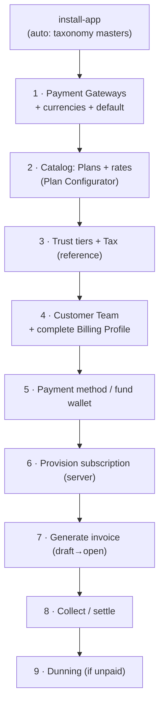

# Billing — Setup & Demo Runbook (empty site → working billing)

> How to stand up billing on a **fresh `central.localhost` site** and demonstrate it, as the
> admin, from scratch. Two paths:
>
> - **Path A — Seed** (recommended for a demo): one command builds a rich, self-consistent
>   set of teams covering every feature. Use this to *show* billing.
> - **Path B — Manual** (to *understand* the config surface): configure each piece by hand,
>   the way a real operator onboards a fresh deployment.
>
> Companion docs: [`ARCHITECTURE.md`](./ARCHITECTURE.md) (how the code is wired),
> [`../../spec/README.md`](../../spec/README.md) (specs). Paths below are relative to `central/billing/`. Run bench commands from the bench root.

---

## 0. Prerequisites (both paths)

Set up the bench, the site, the gateway test keys, and the billing worker as the [README](../../README.md) describes. The seed path uses placeholder keys (`skip_credential_validation`) and runs offline. Only real charges, top-ups, and e2e need live test keys.

---

## Path A — Seed a demo in one command

```bash
# Full-spectrum dataset (10 teams: tiers t0–t3, five USD and five INR, every
# collection mode and terminal state). Wipes all billing data first:
pilot frappe --site central.localhost execute central.billing.demo.demo_scenarios.seed

# Sanity counts proving each criterion is covered:
pilot frappe --site central.localhost execute central.billing.demo.demo_scenarios.summary
```

What `seed` builds (in order): trust tiers → catalog (Regions `in-bengaluru`, `in-mumbai`, `me-dubai`; VM plans through the Plan Configurator; the component rate card; the metered services AI Tokens, Email and PDF) → gateways (one Stripe row for INR and USD, Razorpay INR, PayPal USD) → Ed25519 signing key → then per team: members, billing profile, tier, tax, subscriptions, historical Paid invoices, and the current-month invoice in the team's terminal state. The current month is the month the seed runs in (`ANCHOR` is its first day). `seed_all` is a back-compat alias for `seed`.

The seed is **idempotent + destructive**: it `_wipe_all()`s billing data first, so re-run
freely. Administrator is a System Manager and lands on a team with data — just open
`http://central.localhost:8000` and go to the billing dashboard.

### What each demo team demonstrates
See [demo/README.md, The ten teams](./demo/README.md#the-ten-teams).

---

## Path B — Configure from scratch as admin

The order matters: **reference data → catalog → gateways → customer → money**. Each step
names the UI doctype and the programmatic call so you can do either.



### Step 1 · Payment Gateways
Each adapter has one **Payment Gateway** row. The row is named after its `adapter_key` (`Stripe` / `Razorpay` / `Paypal`) and has no title field. `gateways.setup.ensure_gateway_records` seeds one disabled, blank row per adapter on install and migrate. To configure a gateway, open its row, fill in `api_key`, `api_secret` and `webhook_secret`, add a **currencies** child row per currency it serves (set `is_default` for the currency it is the default for), and set `is_enabled`. Razorpay needs `supports_mandates` for UPI Autopay / e-mandate.
- **UI:** Desk → *Payment Gateway* → open the adapter's row (one row per adapter; one Stripe row can serve several currencies).
- **Admin API:** `api/admin/gateways` → `get_gateways`, `set_default_gateway`,
  `get_effective_routing` (which gateway wins for a currency).
- Routing rule: `gateways/registry.resolve_gateway_for_currency` picks the default-enabled
  gateway for the invoice currency.

### Step 2 · Catalog — Plans & rates
Taxonomy masters are already seeded. Now create **Plans** and **price them per cluster ×
currency** (rates live in standalone **Catalog Rate**, not on the Plan).
- **Preferred:** the **Plan Configurator** is the single pricing authority (ADR 0011).
  Desk → *Plan Configurator*: pick a category/sub-category, set base rates + a t-shirt-size
  ladder, then `generate_plans` / `apply_pricing` mints the Plans and their rates.
  (`catalog/configurator.py`; whitelisted via the doctype controller.)
- **Direct:** `catalog/plans.create_configured_plan`, then
  `catalog/pricing.set_catalog_rates("Plan", plan, [{cluster, currency, rate}, …])`.
- Verify a price: `catalog/pricing.resolve_rate` / `get_plan_pricing`.

### Step 3 · Trust tiers & Tax (reference data)
- **Trust Tier Level** rows with per-currency **Trust Tier Threshold** children define the
  spend caps a team climbs through. Caps resolve live (`catalog/entitlements.get_team_caps`);
  there is no per-team tier doctype.
- **Tax Profile** per team drives GST (additive) / SEZ (zero-with-reason) / TDS (withholding)
  — `revenue/tax.resolve_tax`. India GST codes live in `india_gst.py`.

### Step 4 · Customer Team + Billing Profile
Charging a card needs a **complete Billing Profile**. Its `currency` is the source of truth (gateway-backed, locks after first activity). Credit can fund server creation without a complete profile. The team's invoices are then held at Draft until the billing details arrive. A daily job reminds the team, and operators get an alert after `billing_details_grace_days`.
```bash
pilot frappe --site central.localhost execute central.billing.payments.profile.create_or_update_billing_profile \
  --kwargs '{"team": "<TEAM>"}'
```
- **UI:** the customer SPA first-run wizard (`api/dashboard/account.save_billing_profile`).
- Set currency + country (GST state for INR) before any charge.

### Step 5 · Payment method or wallet funding
- **Card:** `api/dashboard/methods.initiate_card_setup` → `confirm_card` (real Stripe SetupIntent).
- **Wallet top-up:** `api/dashboard/invoices.create_topup_order` → `confirm_topup`, or
  programmatically `revenue.credits.purchase(team, amount, currency, …)` → appends a
  **Credit Ledger Entry** and updates the **Credit Wallet**.
- INR rails: `payments/collection_mode` enforces the ₹15k silent-debit ceiling, read off the
  gateway's currency row (ADR 0022); set the team's mode (Auto Charge / Manual Checkout / Prepaid).

### Step 6 · Provision a subscription (a "server")
```bash
pilot frappe --site central.localhost execute central.billing.catalog.subscriptions.provision_subscription \
  --kwargs '{"team":"<TEAM>","cluster":"in-mumbai","plan":"<PLAN>","billing_cycle":"Monthly"}'
```
Creates the **Subscription** (intent) and its first **Subscription Change** row carrying the `locked_rate`. It does not create a server: it mints a `res-<hash>` resource id. Pass a real Plan name for `<PLAN>`; Plans are hash-autonamed. Composed configs: `provision_composed_subscription(team, cluster, includes, sub_category, …)` or the UI `api/dashboard/catalog.provision_composed_config`.

Real servers go through `central.api.servers.create_server` / `create_composed_server` → `central.resource_actions.submit_request`. The Virtual Machine controller creates the Subscription when the server reaches Running.

### Step 7 · Generate the invoice
> Invoice generation runs monthly on the scheduler through `run_monthly_billing`, which drafts and collects inline (see `ARCHITECTURE.md` §3). For a demo, drive it by hand. The calls below do the same work.
```bash
# One team, one period (in arrears):
pilot frappe --site central.localhost execute central.billing.revenue.invoicing.generate_team_invoice \
  --kwargs '{"team":"<TEAM>","period_start":"2026-06-01","period_end":"2026-06-30"}'
# …or all teams for the period (the draft phase, inline):
pilot frappe --site central.localhost execute central.billing.revenue.invoicing.generate_draft_invoices \
  --kwargs '{"period_start":"2026-06-01","period_end":"2026-06-30"}'
```
Lines come from `invoicing/lines.compute_line_items` (day-weighted Subscription Change
segments) + metered overage + commitment discount + tax. Result: **Invoice (Draft)**.

### Step 8 · Open & collect (settle)
```bash
# The collect phase — runs the credits→card waterfall per draft:
pilot frappe --site central.localhost execute central.billing.revenue.invoicing.open_drafts \
  --kwargs '{"cutoff":"2026-06-30"}'
```
A Billable draft for a team without billing details stays Draft (`held: billing_details`). It is settled when the team completes its Billing Profile.
`open_and_collect` applies credits first, charges the card for the remainder, and flips
Draft → Open → (on webhook) Paid. On a local bench you won't receive a live webhook — the
e2e suite delivers it via `tests/e2e.py:deliver_webhook` from a real captured txn id; for a
manual demo, the seed path already shows Paid invoices.

### Step 9 · Dunning (unpaid path)
Leave an invoice unpaid and run the daily job to walk the Day 1/3/7 retries → past_due →
suspend:
```bash
pilot frappe --site central.localhost execute central.billing.revenue.dunning.run_dunning
```

---

## Reset / teardown

```bash
# Re-seeding wipes billing data first, so just re-run the seed to reset:
pilot frappe --site central.localhost execute central.billing.demo.demo_scenarios.seed

# Or wipe billing records only (leaves catalog/gateway config):
pilot frappe --site central.localhost execute central.billing.demo._factory._wipe_all
```

For e2e isolation, each Playwright spec seeds + tears down its own sandbox via
`central/billing/tests/e2e.py` (`seed`/`teardown`, gated behind `allow_tests: true`). See
`e2e/README.md`.

---

## Quick reference — what's automatic vs. manual

| Piece | Auto (on install/migrate) | Manual (admin) |
|---|---|---|
| Catalog taxonomy masters | ✅ `ensure_catalog_masters` | — |
| Payment Gateways + keys | ✅ one disabled row per adapter (`ensure_gateway_records`) | ✅ Desk: fill keys and currencies, enable |
| Plans + rates | — | ✅ Plan Configurator |
| Trust tiers / Tax profiles | — | ✅ reference data |
| Billing Profile (per team) | — | ✅ wizard (gates money) |
| Invoice generation | ✅ monthly `run_monthly_billing` (draft, then collect, inline) | ✅ `run_monthly_billing` / `generate_*` / `open_drafts` |
| Dunning / reconciliation / e-mandate / card expiry | ✅ scheduled | — |
