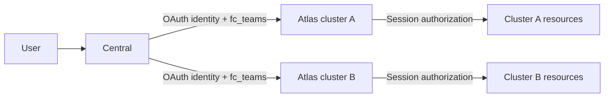
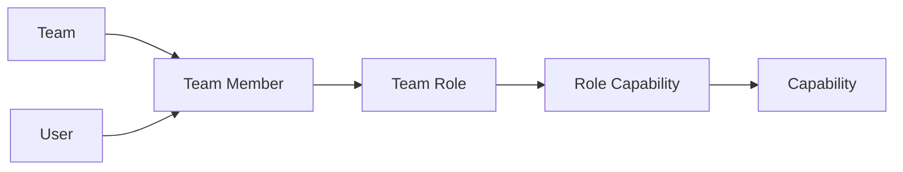
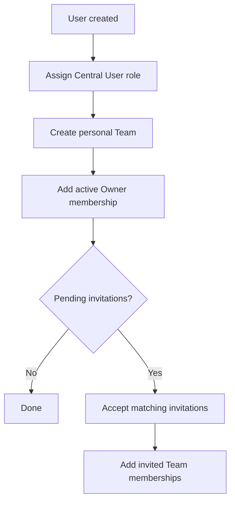
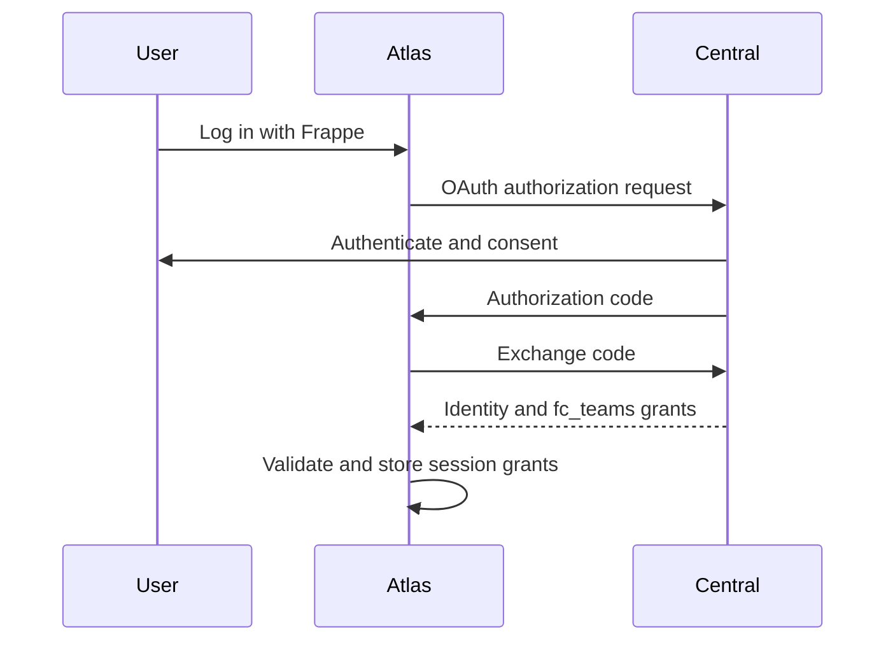
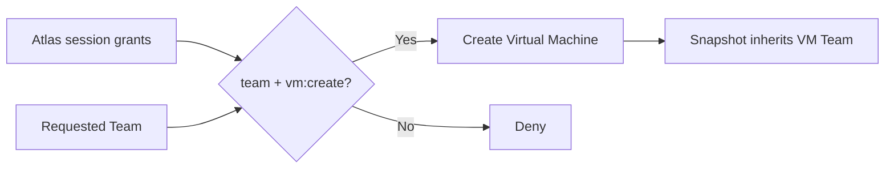

# Central IAM

## Architecture



- Central is the global authority for users, Teams, roles, and capabilities.
- Every cluster runs a separate Atlas site with its own OAuth credentials.
- Atlas validates the Central OAuth response and stores grants in its local session.
- Atlas does not call Central for every authorization decision.
- `System Manager` is the only authorization bypass.

## Permission Model



Central owns:

- `Team`
- `Team Member`
- `Team Role`
- `Role Capability`
- `Capability`
- `Team Invitation`
- `IAM Permission Probe`

A member receives capabilities through one path:

`Team Member -> Team Role -> Role Capability -> Capability`

There are no per-user capability overrides. A Team owner is an active
`Team Member` with the `Owner` role.

| Role | Intended access |
| --- | --- |
| Owner | All Team capabilities |
| Admin | Team management and VM operations, excluding billing |
| Developer | VM operations |
| Viewer | Read-only VM access |
| Billing | Billing and read-only Team access |

A member has one role per Team. Create a custom Team role when a member needs a
combination such as administration and billing.

VM capabilities include `vm:view`, `vm:create`, `vm:start`, `vm:stop`,
`vm:resize`, `vm:snapshot`, `vm:rebuild`, `vm:clone`, and `vm:terminate`.

## User And Invitation Flow



- Every non-guest user receives a personal Team.
- Team creation always creates an active Owner membership.
- Existing users must explicitly accept invitations.
- For a newly created user, invitations sent to the same email are accepted
  after the personal Team has been created.
- Invitations cannot grant the `Owner` role.
- Accepting an invitation adds or activates membership in the inviting Team; it
  does not replace the user's personal Team.

Example: John and Jane each have a personal Team. If John invites Jane to
John's Team, there are still two Teams. Jane owns Jane's Team and is also a
member of John's Team.

## OAuth Contract



Atlas uses the canonical Social Login Key `frappe` provider and overrides only
the Frappe login handler needed to consume Central grants.

The `fc_teams` claim maps each Team to its grants:

```json
{
  "team-id": [
    {
      "role": "Developer",
      "source": "member",
      "scope": "*",
      "caps": ["vm:view", "vm:start", "vm:stop"]
    }
  ]
}
```

- Missing, malformed, or untrusted grants provide no authority.
- A local Atlas user has no Central Team access without valid `fc_teams` grants.
- Atlas exposes reusable `can`, `require_capabilities`, and
  `requires_vm_capabilities` authorization helpers.
- Observe-only endpoints expose current session grants and permission checks.
  They must not mutate grants or resources.

Observe-only endpoints:

- Central: `central.api.identity.fc_teams`,
  `central.api.identity.effective_permissions`,
  `central.api.identity.check_capability`
- Atlas: `atlas.atlas.api.iam.session_grants`,
  `atlas.atlas.api.iam.check_session_capability`

## Atlas Resource Contract

`Virtual Machine` and `Virtual Machine Snapshot` carry an immutable, indexed
`team` Data field containing the Central Team identifier.



Attribution rules:

- New VMs require an explicit Team and `vm:create` for that Team.
- Snapshots inherit their VM's Team.
- Clone and rebuild operations cannot cross Team boundaries.
- Legacy unattributed resources are operator-only.
- Resource ownership must never be inferred from the Frappe document owner.

Canonical routes use the Team identifier:

- `/dashboard/t/<team>/machines`
- `/dashboard/t/<team>/machines/<machine>`

Read rules:

- `System Manager` can read all resources.
- Other users require `vm:view` for the resource Team.
- List filters use `permission_query_conditions`; document reads use
  `has_permission`.
- Linked operational records, including Tasks, inherit visibility from their VM.
- An empty or malformed grant set denies access.

| Action | Required capability |
| --- | --- |
| Create, provision, retry provision | `vm:create` |
| Start, resume | `vm:start` |
| Stop, pause | `vm:stop` |
| Restart | `vm:stop` and `vm:start` |
| Resize | `vm:resize` |
| Snapshot | `vm:snapshot` |
| Rebuild | `vm:rebuild` |
| Clone | `vm:view` and `vm:clone` |
| Terminate | `vm:terminate` |

Loaded-document actions should use the authorization decorator. Creation and
cross-resource actions should perform explicit checks because no single loaded
document establishes the authorization boundary.

## Deferred Scope

- Resource groups
- Partner and reseller access
- Per-VM ACLs
- Bench authorization
- Billing enforcement
- Session grant refresh
- Delegated custom-role administration
