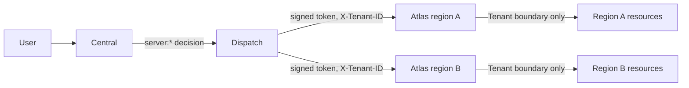
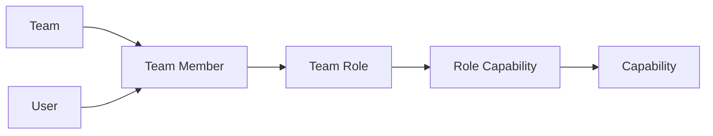
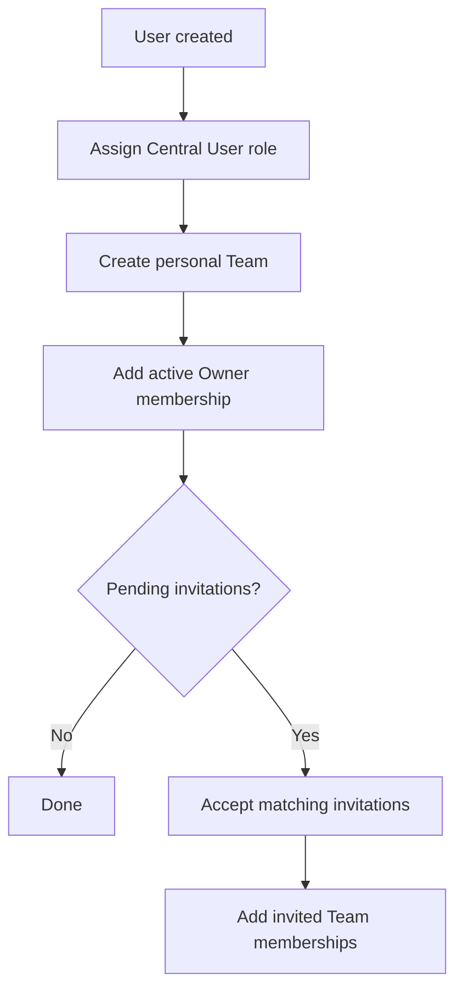

# Central IAM

## Architecture

- Central is the global authority for users, Teams, roles, and capabilities. Every `server:*` decision is made here, before any regional call.
- A region never sees a capability. Central signs a short-lived, tenant-scoped token for the call it is about to make; the region checks only that the token's tenant matches the resource's tenant. See [Atlas coordination](ATLAS_COORDINATION.md).
- `System Manager` is the only authorization bypass.

## Permission Model

Central owns:

- `Team`
- `Team Member`
- `Team Role`
- `Role Capability`
- `Capability`
- `Team Invitation`
- `IAM Permission Probe`

A member receives capabilities through one path:

`Team Member -> Team Role -> Role Capability -> Capability`

There are no per-user capability overrides. A Team owner is an active
`Team Member` with the `Owner` role.

| Role | Intended access |
| --- | --- |
| Owner | All Team capabilities |
| Admin | Day-to-day team, server, and billing operations, excluding team deletion and ownership transfer |
| Developer | Full server operations |
| Viewer | Read-only server access |
| Billing | Billing and read-only server access |

A member has one role per Team. Create a custom Team role when a member needs a
combination such as administration and billing.

Server is the atomic unit (capability model v3): role capabilities live at the
team and server level only. Server capabilities are `server:view`,
`server:create`, `server:power`, `server:resize`, `server:snapshot`,
`server:terminate`, and `server:open`, plus `cluster:view` for placement. The
site-level (bench-plane) capabilities are deferred; see
[`CAPABILITIES.md`](../CAPABILITIES.md) for the full taxonomy.

## User And Invitation Flow

- Every non-guest user receives a personal Team.
- Team creation always creates an active Owner membership.
- Existing users must explicitly accept invitations.
- For a newly created user, invitations sent to the same email are accepted
  after the personal Team has been created.
- Invitations cannot grant the `Owner` role.
- Accepting an invitation adds or activates membership in the inviting Team; it
  does not replace the user's personal Team.

Example: John and Jane each have a personal Team. If John invites Jane to
John's Team, there are still two Teams. Jane owns Jane's Team and is also a
member of John's Team.

## Deferred Scope

- Resource groups
- Partner and reseller access
- Per-server ACLs
- Bench authorization
- Billing enforcement
- Delegated custom-role administration
