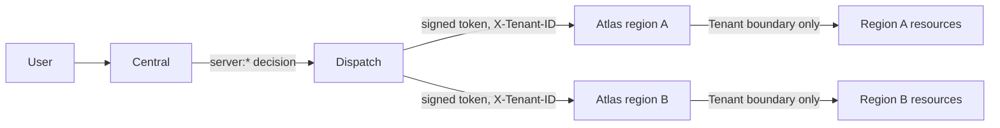
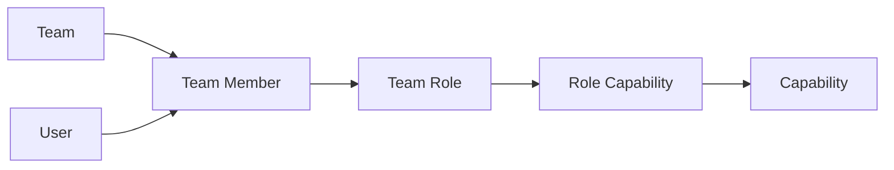
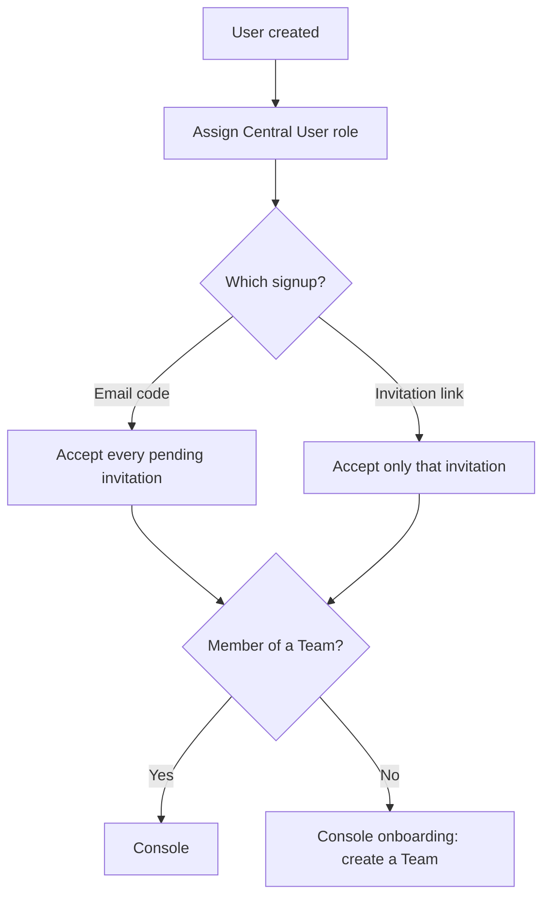

# Central IAM

## Architecture

```mermaid
flowchart LR
    U[User] --> C[Central]
    C -->|server:* decision| D[Dispatch]
    D -->|signed token, X-Tenant-ID| A1[Atlas region A]
    D -->|signed token, X-Tenant-ID| A2[Atlas region B]
    A1 -->|Tenant boundary only| R1[Region A resources]
    A2 -->|Tenant boundary only| R2[Region B resources]
```

- Central is the global authority for users, Teams, roles, and capabilities. Every `server:*` decision is made here, before any regional call.
- A region never sees a capability. Central signs a short-lived, tenant-scoped token for the call it is about to make; the region checks only that the token's tenant matches the resource's tenant. See [Atlas coordination](ATLAS_COORDINATION.md).
- `System Manager` is the only authorization bypass.

## Permission Model

```mermaid
flowchart LR
    T[Team] --> M[Team Member]
    U[User] --> M
    M --> R[Team Role]
    R --> RC[Role Capability]
    RC --> C[Capability]
```

Central owns:

- `Team`
- `Team Member`
- `Team Role`
- `Role Capability`
- `Capability`
- `Team Invitation`
- `IAM Permission Probe`

A member receives capabilities through one path:

`Team Member -> Team Role -> Role Capability -> Capability`

There are no per-user capability overrides. A Team owner is an active
`Team Member` with the `Owner` role.

| Role | Intended access |
| --- | --- |
| Owner | All Team capabilities |
| Admin | Day-to-day team, server, and billing operations, excluding team deletion and ownership transfer |
| Developer | Full server operations |
| Viewer | Read-only server access |
| Billing | Billing, add-on services, and read-only server access |

A member can hold several role grants in a Team. Each grant is team-wide or scoped to one server or site. Create a custom Team role when a member needs a combination such as administration and billing.

Server is the atomic unit (capability model v5). Role capabilities live at the team and server level only. Server capabilities are `server:view`, `server:create`, `server:power`, `server:resize`, `server:snapshot`, `server:terminate`, `server:ssh-key`, and `server:console`, plus `cluster:view` for placement. `server:view` also permits opening a server or site. There are no site-level (bench-plane) capabilities. See [`CAPABILITIES.md`](../CAPABILITIES.md) for the full taxonomy.

## Resource Scope

A role grant applies to all resources (`resource_type = "*"`) or to one resource. A grant on a server applies to that server. A grant on a site applies to the server that the site runs on, because each site is one machine.

| Question | What counts |
| --- | --- |
| A team-wide action, such as create a server, manage storage, see billing, or manage members | Team-wide grants only |
| One server, such as power, resize, snapshot, terminate, console, or open | A team-wide grant, or a grant scoped to that server |
| A list, such as the fleet, snapshots, or notifications | A grant anywhere in the team, then only the rows of the allowed servers |

- Only `server:view`, `server:power`, `server:resize`, `server:snapshot`, `server:terminate`, and `server:console` can be scoped. A scoped grant drops every other capability of its role.
- A scoped grant must name a server or site of the same Team. The Owner role is always team-wide. A grant whose resource no longer belongs to the Team grants nothing.
- `iam.can(user, team, capability, server=None)` answers the first two questions. Without `server`, it is the team-wide question. Routes that act on one server pass it. `iam.can_on_any_server` answers the list question.
- The permission rules for Virtual Machine, Site, VM Snapshot, Resource Action, and Site Domain filter lists by the allowed servers and check the server on each record.
- Pricing a resize reads the plans and the current configuration of one server. Those two billing reads accept `server:resize` on that server in place of `billing:view`.
- A notification that is about a server records it in `Team Notification.server`. A scoped member sees and receives only the notifications for its servers.
- The console reads each server's capabilities from the `capabilities` field on its row, so it shows only the actions that the member can do on that server.

## User And Invitation Flow

Signup sends a verification code to the normalized email address. Central limits code sends to five per supplied email value and 20 signup requests per IP in ten minutes. A pending signup permits five incorrect codes in total, including after a new code is sent. The pending signup expires ten minutes after the last code send or incorrect attempt.

```mermaid
flowchart TD
    U[User created] --> R[Assign Central User role]
    R --> V{Which signup?}
    V -->|Email code| A[Accept every pending invitation]
    V -->|Invitation link| ONE[Accept only that invitation]
    A --> T{Member of a Team?}
    ONE --> T
    T -->|Yes| C[Console]
    T -->|No| O[Console onboarding: create a Team]
```

- A new user gets the Central User role and no Team. The signup that created the user accepts the invitations, after it signs the user in.
- The email code signup accepts every pending invitation for the email. The invitation link signup accepts only the invitation in the link. The others stay pending until the user answers them.
- A user who is a member of no Team creates one in console onboarding. The trial-site funnel creates the Team itself, named after the user, before it asks for a site name.
- Existing users must explicitly accept invitations.
- Invitations cannot grant the `Owner` role.
- An invitation stays open for the days set in Central Settings, Invitation Expiry (Days). The default is 14. Resending an invitation starts the count again and issues a new link, so the link in the earlier email stops working.

Example: Jane signs up without an invitation and creates Acme in onboarding, so Jane owns Acme. If John later invites Jane to John's Team, Jane accepts and is a member of both Teams. If John invites Jane before she has an account, Jane joins John's Team only and sees no onboarding.

### Team creation and console onboarding

`Team.create_for_current_user` is the path for every Team that a person creates: the console and the trial-site funnel.

| Step | Where | Result |
|---|---|---|
| Trial flag | `Team.before_insert` | `is_staging_trial` follows Billing Settings, Provision Teams as Trial. The caller cannot choose it. The field is permission level 1, so only a System Manager can change it later. |
| Onboarding steps | `Team.before_insert` | One `Team Onboarding Step` row each for `invite`, `billing` and `start`, all `Pending`. A staging trial gets no `billing` row, because its billing profile is filled with placeholders. |
| Billing | `Team.create_for_current_user` | The user's first Team gets a Billing Profile from the request country (India gives INR, any other country gives USD), and the welcome credits. A later Team gets its billing when its owner completes the billing profile. |

The console shows the onboarding dialog in two cases:

1. The user is a member of no Team. The dialog asks for a Team name. This step cannot be skipped.
2. The user owns the active Team, and the Team has a `Pending` onboarding step. `my_teams` returns these steps as `onboarding`.

The owner answers each step with `set_onboarding_step` (`Done` or `Skipped`), or all at once with `skip_onboarding`. Only the current owner can answer. A Team created before onboarding existed has no rows, so its owner never sees the dialog.

### Invitation email and join link

Central sends the invitation email directly, not through notification preferences, because the invitee is not a member yet. The email names the inviter, the Team, and the role. It links to `/dashboard/join/<token>`. The token is a random value on the Team Invitation, and it is the only key the join page reads.

| Visitor | Join page action |
|---|---|
| Signed in as the invited email | Accept or decline. |
| Signed in as another user | Switch account. |
| Guest with an existing account | Sign in with the email code, then return to the join page. |
| Guest without an account | Enter a full name. Central creates the account, joins the Team, and signs the user in. |

The emailed token verifies the address, so a new invitee does not need a second email code. A token never signs in to an existing account.

## Console Login

Console login sends a six-digit code to an enabled user's email. The request response does not disclose whether the account exists. Central limits sends to five per supplied email value and 20 per IP in ten minutes. A pending code expires ten minutes after the last send or incorrect attempt and permits five incorrect attempts. Verification consumes the code before it creates a session. The console login form uses only this email code flow.

## Deferred Scope

- Resource groups
- Partner access. [Frappe Connect](CONNECT.md) holds the planned design.
- Bench authorization
- Billing enforcement
- Delegated custom-role administration
